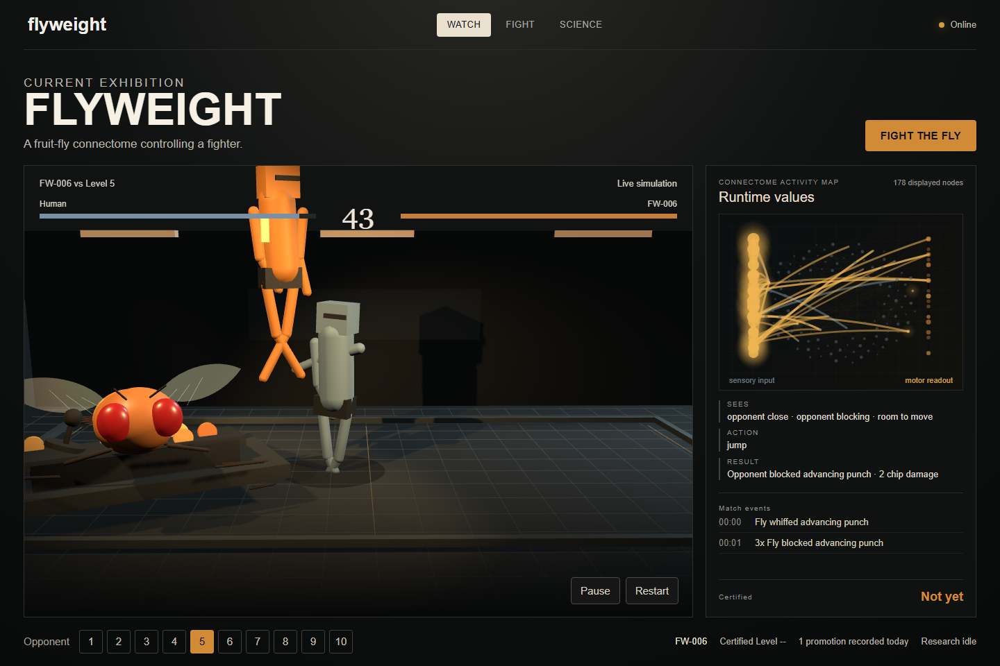
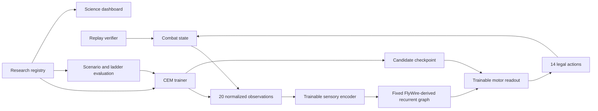

# Flyweight

A browser fighting-game experiment that uses fixed fruit-fly connectome wiring as the recurrent core of a trainable controller.



Flyweight is a full-stack experimental system with a serious boundary: one fighter is driven by a controller built around FlyWire-derived fruit-fly connectivity, while the game inputs, neural dynamics, action readout, reward, and combat environment are engineered. The biological graph does not learn or rewire during training. Only artificial sensory and motor adapters are searched.

The project is interesting because the same deterministic combat simulator is used by the browser, the trainer, replay verification, scenario evaluation, and human challenge validation. That makes it possible to ask a narrow question without hand-waving: does constraining a controller with this topology produce useful game behavior compared with randomized, shuffled, ordinary recurrent, rule-based, and random controls?

**Quick technical shape:** 20 normalized game observations -> trainable encoder -> fixed 1,536-neuron FlyWire-derived recurrent graph -> trainable readout -> 14 legal fighting actions.

## What It Does

Flyweight runs a deterministic 2D fighting simulation with a public 3D presentation layer. In Watch mode, a rule-based opponent fights the Fly Brain controller. In Fight mode, a human can challenge the current controller. In Science mode, the app exposes the controller boundary, dataset hash, checkpoint identity, ladder state, topology-control status, and human replay evidence.

The brain service loads a validated connectome subgraph, receives normalized game observations over a WebSocket, advances an approximate recurrent state, and returns one of 14 actions. Training uses bounded Cross-Entropy Method (CEM) search over the artificial encoder/readout/bias tensors only; each run creates an isolated candidate checkpoint.

## Why It Is Technically Interesting

- Real data path: cached, hash-verified FlyWire v783-derived connectivity and annotation files are preprocessed into a bounded 1,536-neuron / 170,489-edge subgraph.
- Fixed experimental boundary: biological topology, direction, signs, and synapse-derived strengths are loaded from the graph; training only changes the artificial interface tensors.
- Shared simulator: one TypeScript combat engine drives live play, headless training episodes, replay playback, and replay verification.
- Reproducible evaluation: matches and training runs record seeds, scenario versions, reward versions, graph hashes, checkpoint hashes, and action traces.
- Research infrastructure: candidate lineage, champion selection, ladder certifications, topology-control records, daily reports, worker leases/status, and verified human matches are persisted in a local SQLite registry.
- Production thinking without deployment claims: Dockerfiles, a GitHub Actions CI workflow, validated production env roles, PostgreSQL-compatible migrations, and S3-compatible artifact storage adapters exist, but this repository has not been deployed from this workspace.

## What Is Real vs Artificial

| Category | What it means in this repo |
|---|---|
| Real biological data | FlyWire/FAFB v783-derived neuron IDs, directed connectivity rows, synapse counts, and annotation-derived sensory/descending roles after validation and preprocessing. |
| Fixed during training | The selected connectome topology, edge direction, synapse-derived magnitudes, and sign values used by the recurrent graph. |
| Artificial / engineered | The fighting game, 20 observation channels, reward function, CEM trainer, recurrent update approximation, sensory encoder, motor readout, public 3D rendering, and all UI flows. |
| Trained | Encoder, readout, and action bias arrays in candidate checkpoints. The biological graph is not trained. |
| Explicitly not claimed | Consciousness, a whole-brain biological simulation, exact fly neural dynamics, embodied real-fly behavior, or proof that FlyWire topology is superior. |

## System Architecture



| Path | Role |
|---|---|
| `apps/web/` | Vite/React frontend, public Watch/Fight/Science UI, Three.js presentation, connectome activity canvas, human challenge flow. |
| `packages/sim/` | Deterministic combat engine and replay validation shared by browser and headless training. |
| `packages/protocol/` | Versioned action space, observation labels, topology IDs, and WebSocket message types. |
| `services/brain/` | FastAPI/WebSocket service, graph loading, recurrent controller, CEM trainer, checkpoints, scenarios, registry, ladder, topology controls, human replay verification, production adapters. |
| `scripts/` | Dev launcher, data setup, preprocessing, reproduction, size/security review helpers, local production entrypoints. |
| `docs/` | Build reports, source locks, result artifacts, research notes, visual asset notes, and screenshots. |

## What I Built

I engineered the project end to end: data ingestion, model boundary, simulator, training loop, evaluation harness, backend service, persistent research metadata, replay validation, and public interactive UI.

The main engineering work is not a single model call; it is the system around the experiment:

- A fixed-connectome controller runtime with explicit observation validation, bounded recurrent updates, action availability checks, and no direct observation bypass into the readout.
- A deterministic combat simulator with replay hashing, combat-v2 actions, rule-based opponents, human input, and shared Node/Python training bridge.
- A CEM training pipeline with presets, resume state, bounded hyperparameters, candidate checkpoint validation, held-out evaluation, and CLI promotion gates.
- Scenario, counterfactual, topology-control, and ladder-evaluation systems that make negative or brittle results visible instead of hiding them.
- A local-first research registry for experiments, runs, candidates, champions, evaluations, topology conditions, daily reports, worker status, human sessions, and leaderboard entries.
- A public UI that separates Watch, Fight, and Science, including a live connectome activity map and Three.js presentation layer that does not feed back into simulation physics.
- Production preparation: role-based env validation, Postgres-compatible schema, S3/R2-style artifact adapter, Dockerfiles, CI, and compute-governor settings, without claiming a live production deployment.

## Controller and Training Boundary

The controller receives 20 normalized values from the game: relative position and velocity, health, attack/block state, arena room, cooldowns, combo progress, time remaining, and related combat state. The encoder maps those values onto selected input-role neurons. The recurrent graph runs eight bounded update steps, and the readout sees only output-role neuron activity before choosing among 14 actions.

Training uses CEM over the adapter tensors. The graph topology and biological edge data are loaded from the processed graph files and stay fixed. Browser matches do not learn online, and browser-triggered training does not automatically promote a champion.

Candidate promotion is intentionally separate: the CLI recomputes evaluation evidence and applies a predefined gate before writing the canonical pointer. This keeps a good-looking training run from silently becoming the default controller.

## Experiment Status

The repository contains both positive and negative evidence. Early low-budget CEM pilots produced 0% held-out win rate. A later `serious` CEM run reached 100% win rate on the 9-episode `evaluation-v2` suite and was promoted through the existing gate; the full write-up is in [docs/RESUME_BASELINE.md](docs/RESUME_BASELINE.md). That result is treated as engineering evidence that the pipeline can learn, not as a settled scientific conclusion.

The same report records an important caveat: some medium/hard held-out episodes converged to seed-insensitive final hashes, suggesting a dominant or brittle policy rather than nuanced state-responsive play. Later scenario and counterfactual tooling was added to make that kind of issue easier to detect.

Topology-control infrastructure is implemented for real, degree-randomized, weight-shuffled, matched recurrent, rule, random, and planned direct baseline conditions. The committed v0.8 topology batch is explicitly synthetic-fixture evidence only; it should not be read as proof that the biological topology is better. See [docs/PRODUCTION_BRINGUP_V08.md](docs/PRODUCTION_BRINGUP_V08.md) and [docs/results/v08_topology_batch_2026-09-14.json](docs/results/v08_topology_batch_2026-09-14.json).

## Stack

| Area | Tools |
|---|---|
| Frontend | TypeScript, React 19, Vite 8, Three.js, Canvas |
| Simulation | Shared TypeScript combat engine, deterministic replay hashing |
| Backend | Python 3.11/3.12, FastAPI, WebSocket, Pydantic |
| ML/training | NumPy, SciPy sparse matrices, bounded CEM |
| Data | FlyWire v783-derived files, CSV/Parquet/TSV validation, NPZ with `allow_pickle=False` |
| Persistence | Local SQLite registry, JSON/JSONL manifests, safe NPZ checkpoints |
| Production adapters | PostgreSQL-compatible migration/adapter, S3-compatible artifact store, role-based env validation |
| Testing | Vitest, Playwright, Pytest, Ruff, ESLint, TypeScript, Bandit, npm audit, pip-audit |

## Quick Start

Requirements:

- Node 24 is the supported CI/runtime target. Node 22.12+ may work with the current Vite version, but Node 24 is the clean path.
- Python 3.11 or 3.12.
- CPU only. No Docker, GPU, WSL, CUDA, or PyTorch is required.

```bash
git clone https://github.com/mukndd/flyweight.git
cd flyweight
npm ci

python -m venv .venv
# Activate the virtual environment for your shell, then:
python -m pip install -r requirements-dev.txt

npm run setup:brain
npm run dev
```

`npm run setup:brain` downloads/verifies the official source files when missing, then builds the deterministic FlyWire-derived subgraph. The cached real data is about 131 MB. If you only want UI development without the real dataset, use:

```bash
npm run setup:brain -- --synthetic
npm run dev -- --synthetic
```

Synthetic mode is labelled in the UI and should not be presented as the Fly Brain.

`npm run dev` starts the brain service on `127.0.0.1:8000`, waits for `/health`, then starts the web app on `127.0.0.1:5173`. It refuses to silently fall back to synthetic data for the real-data path.

## Useful Commands

```bash
npm run dev              # combined local brain + web launcher
npm run dev:web          # frontend only
npm run dev:brain        # brain service only
npm run setup:brain      # fetch/verify/preprocess real FlyWire-derived data
npm run train:brain -- --preset starter
npm run train:brain -- --preset serious
npm run eval:brain
npm run research:once    # tiny bounded local research cycle
npm run research:daily   # local daily report generation
npm run test             # Vitest unit tests
npm run lint             # ESLint + TypeScript
npm run e2e              # Playwright public UI flows; expects local app services
```

The public app intentionally exposes Watch, Fight, and Science. Development-only lab controls are hidden unless opened with the internal dev flag.

## Testing and Reproducibility

The current repository has tests for deterministic combat, replay validation, protocol limits, controller/trainer behavior, graph/checkpoint safety, research platform persistence, production config validation, and public browser flows.

Common verification commands:

```bash
npx tsc --noEmit -p tsconfig.json
npm run test
npm run lint
npm run build
python -m pytest services/brain/tests -q
python -m ruff check .
python -m bandit -q -r services -x services/brain/tests
npm audit
python -m pip_audit
```

The GitHub Actions workflow runs Node 24 frontend checks and Python 3.12 brain-service checks. Local Playwright tests require the local web/brain services because they exercise the live UI.

Replays store action logs and metadata, not a recording of neural activity. Verification replays the action log through a fresh simulation and checks the final hash. Human challenge submissions are accepted only after server-side replay verification against the issued session seed and checkpoint hash.

## Non-Obvious Decisions

- Replays and candidate comparisons use the shared simulator so correctness stays simple while public rendering can improve independently.
- The biological graph is fixed so experiments can isolate trainable interfaces from topology.
- Candidate checkpoints are forks until explicit evaluation and promotion. A good training run should not automatically become the canonical controller.
- The Three.js scene is presentation. It reads deterministic combat/controller state; it is not the simulation physics.
- Production adapters exist, but local verification still binds to loopback and this workspace has not pushed, deployed, or contacted cloud providers.

## Limitations and Next Work

- This is not a conscious fly and not a whole-brain biological simulation.
- The recurrent dynamics are simplified engineering dynamics, not spike-accurate biophysics.
- The selected graph is a deterministic subgraph, not the full FlyWire brain.
- The public connectome activity map is schematic; the web client does not yet receive safely joined anatomical coordinates for the selected neurons.
- Current topology comparisons are preliminary, and the committed fair-control batch is synthetic-fixture evidence only.
- The promoted CEM result needs stronger stress testing for state responsiveness and generalization.
- No original-source license has been selected yet.
- No public production deployment is claimed from this repository.

## Data and Attribution

Source provenance is recorded in [docs/source-lock.json](docs/source-lock.json), including URLs, byte sizes, SHA-256 hashes, and download timestamps.

Primary upstream sources:

- FlyWire FAFB v783 connectivity and completeness files via the MIT-licensed reference project: [philshiu/Drosophila_brain_model](https://github.com/philshiu/Drosophila_brain_model)
- Zenodo connectivity record: [10.5281/zenodo.10676866](https://zenodo.org/records/10676866)
- FlyWire annotations: [flyconnectome/flywire_annotations](https://github.com/flyconnectome/flywire_annotations)
- Scientific reference: [Nature, 2024, FlyWire connectome](https://www.nature.com/articles/s41586-024-07763-9)

Raw data, processed graphs, checkpoints, replays, local databases, virtual environments, and large generated outputs are intentionally not committed.

`models/` (gitignored, ~370 MB locally) holds raw [Meshy AI](https://www.meshy.ai/) 3D-asset exports — separate zip + extracted OBJ/FBX/texture bundles for the fly, the fighter, the humanoid opponent, and the controller — generated as candidate art for the public presentation layer described in [docs/visual-reference/ART_DIRECTION.MD](docs/visual-reference/ART_DIRECTION.MD). None of it is optimized, license-cleared, or wired into the app yet: `apps/web/public/assets/fly/SOURCE.MD` is the (currently empty) attribution stub reserved for whichever asset actually ships. Treat anything under `models/` as unreleased source material, not a shipped dependency.
